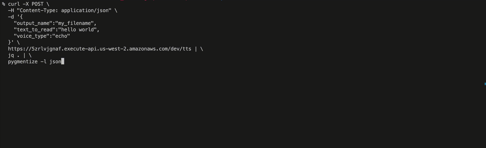

# Text to Speech API

This API is a wrapper to [openai's text-to-speech API](https://api.openai.com/v1/audio/speech).

Use this to expose an API to dynamically generate audio clips, saved in your own S3 bucket.

## Background

This project spins up an API Gateway with Lambda proxy integration and reveals an endpoint to which you may send `POST` requests with some text you wish to get back as a text-to-speech audio file.


# Table of Contents

-   [Text to Speech API](#text-to-speech-api)
    -   [Background](#background)
        -   [Features](#features)
        -   [Cautions Before Use!](#cautions)
        -   [Demo](#demo)
    -   [Installation](#installation)
        -   [Prerequisites](#prerequisites)
        -   [Set AWS Secrets](#set-aws-secrets)
        -   [Populate Terraform Variables](#populate-terraform-variables)
        -   [Initialize Infrastructure](#initialize-infrastructure)
    -   [Usage](#usage)
        -   [Usage Notes](#usage-notes)
    -   [Developing](#developing)
    -   [Motivations](#motivations)

### Features

-   Serverless API and functions
-   Local development possible with AWS SAM
-   Reproducible infrastructure through Terraform
-   100% of AWS resources available in AWS free tier
-   1 audio file costs 1 cent for a 20-40 word input (requires openai API key)
-   S3 bucket objects are secure by default, objects not accessible without a signed URL
-   Signed URLs are generated only during the time that it is requested, which is immediately after the HTTP request

### Cautions

-   (Dec 2023) The API is not secured (as you do not need an authentication token at the API Gateway level). _It is your responsibility_ to add security layers to this infrastructure

### Demo



## Installation

### Prerequisites

-   [An AWS account](https://signin.aws.amazon.com/)
-   [An openai API key](https://platform.openai.com/api-keys)
-   [AWS CLI](https://docs.aws.amazon.com/cli/latest/userguide/getting-started-install.html)
-   The [AWS SAM CLI](https://docs.aws.amazon.com/serverless-application-model/latest/developerguide/install-sam-cli.html) (local development)
-   For local invocation, [Docker](https://docs.docker.com/engine/install/) is also required
-   Note: This project was developed on Apple silicon, so relevant areas have arm64 architecture designated. Please change this as required. You may have to create a x86_64 openai layer if you wish to switch everything over to x86_64.

### Set AWS Secrets

-   Go to [secrets manager](https://us-west-2.console.aws.amazon.com/secretsmanager/listsecrets)
-   Select 'Store a new secret'
-   Populate your secret as `OPENAI_API_KEY`, and put your created openai key in the value field
-   Save it with a unique secret name. You will use this created name to populate your terraform variables.

### Populate Terraform Variables

-   In `tf-resources`, you will see a `variables.tf` file.
-   Initialize these variables by creating a file, `terraform.tfvars`
-   Populate these variables like so:

```bash
aws_region                             = "us-west-2"
profile                                = "default"
openai_layer_abs_path                  = "/Users/dev/src/openai-layer.zip"
s3_bucket_name                         = "dev-bucket"
source_code_path                       = "/Users/dev/src/text_to_voice"
secrets_manager_openai_api_secret_name = "dev/openai/openai_secret"
```

### Initialize Infrastructure

```bash
terraform init
terraform plan
terraform apply
```

`terraform apply` outputs a URL similar to `https://ljdsfsd7.execute-api.us-west-2.amazonaws.com/dev/`

## Usage

Example request

```bash
curl -X POST \
  -H "Content-Type: application/json" \
  -d '{
    "output_name":"my_filename",
    "text_to_read":"hello world",
    "voice_type":"echo"
  }' \
  https://ljdsfsd7.execute-api.us-west-2.amazonaws.com/dev/tts | \
  jq . | \
  pygmentize -l json
```

Example response:

```json
{
    "statusCode": 200,
    "body": {
        "message": "Upload file succeeded",
        "file_url": "https://dev-bucket.s3.amazonaws.com/hello_echo.mp3?AWSAccessKeyId=AKIATVKDXKJZ6&Signature=bazFe6RVL4VcWBASzREzrUBZovk%3D&Expires=1701593603"
    }
}
```

### Usage Notes

The deployed API Gateway accepts a POST request with 3 parameters:

```json
{
    "text_to_read": <text_to_read>,
    "voice_type": <one of ['alloy', 'echo', 'fable', 'onyx', 'nova', 'shimmer']>,
    "output_name": <file_name>
}
```

Lambda routes the `<text_to_read>` to openai, retrieves the mp3 where the text is spoken in `<voice_type>`, stores it in an S3 bucket as `<output_name.mp3>`, and finally generates a signed URL to the audio file to which you may access for 1 hour.

## Developing

-   When developing, run `sam build` to build your latest changes

### Invoking Lambda

CLI - Write response to output.txt

```bash
aws lambda invoke   \
  --function-name my-function   \
      --cli-binary-format raw-in-base64-out  \
          --payload '{"key1": "value1", "key2": "value2", "key3": "value3"}' output.txt
```

## Motivations

https://aws.amazon.com/blogs/compute/better-together-aws-sam-cli-and-hashicorp-terraform/
